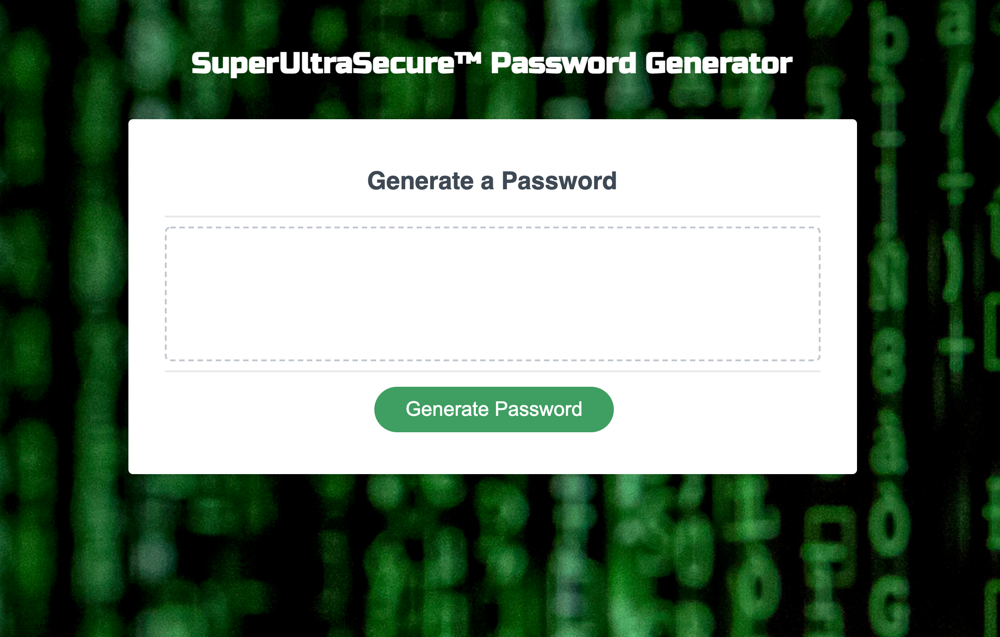

# password-generator

## Description

This is my third homework assignment for the University of Denver Web Development Boot Camp! It's the first real project I've built using JavaScript to make the page interactive. This webpage functions as a password generator. It prompts the user to input data that determines the length and the types of characters to be included in the password. It also validates the data to ensure the password length falls in the specified range, as well as ensuring the user selects at least one type of character (otherwise we couldn't make a password!) The page will then generate the user's password by applying Math.random and Math.floor methods to a string of all the possible password characters based on the user's input. If the user doesn't like the password generated, they can indefinitely keep clicking the "Generate Password" button to generate new, different passwords.

DISCLAIMER: Please don't actually use the passwords generated by this application for anything important - from what I understand, they aren't actually very secure!

## Deployment

The code (and associated assets) are hosted right here in this GitHub repository, and it's all live on the web thanks to GitHub pages. If you would like to check it out, you can view the site at the link below:

<a href="https://lukeoxner.github.io/password-generator" target="_blank"><b>password-generator Live Website</b></a>
  

## Credits

This project was made using HTML, CSS, and Javascript. Portions of the HTML and CSS were provided as 'starter code', but I made some changes and additions as I saw fit. The JavaScript was all written by me!  

Image sources are as follows: 

Background image: <a href="https://www.unsplash.com"><b>www.unsplash.com</b></a> 
